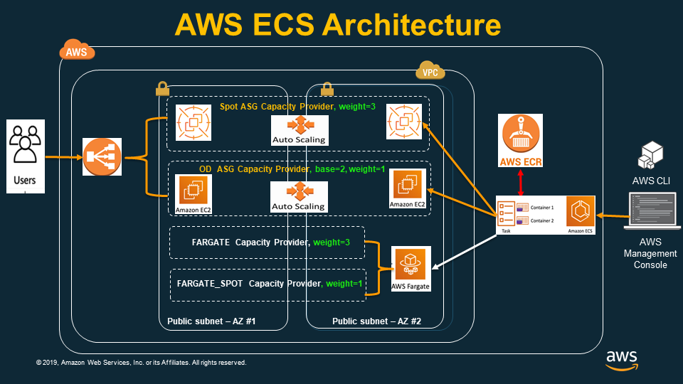

# ECS Fargate Terraform Implementation
---

## Architecture Overview

### Components Deployed:
- **VPC** with public/private subnets
- **Application Load Balancer** (ALB)
- **ECS Fargate Cluster** with auto-scaling
- **CloudWatch Logs** for monitoring
- **IAM Roles** for security
- **Security Groups** for network access

---

## Architecture Diagram



--- 

### Traffic Flow:
1. **Internet** → **ALB** (Public Subnets)
2. **ALB** → **ECS Tasks** (Private Subnets)
3. **ECS Tasks** → **NAT Gateway** → **Internet** (Outbound)
4. **All Logs** → **CloudWatch**

---

## 1. Provider Configuration

### provider.tf
```hcl
provider "aws" {
    access_key = var.aws_access_key
    secret_key = var.aws_secret_key
    region     = var.aws_region
}
```

**Purpose:** Configures AWS provider with credentials and region

---

## 2. Variables Definition

### Key Variables (variables.tf)
```hcl
variable "app_image" {
    description = "Docker image to run in the ECS cluster"
    default = "bradfordhamilton/crystal_blockchain:latest"
}

variable "fargate_cpu" {
    description = "Fargate instance CPU units"
    default = "1024"
}

variable "fargate_memory" {
    description = "Fargate instance memory (MiB)"
    default = "2048"
}
```

---

## 3. Network Infrastructure

### VPC and Subnets (network.tf)
```hcl
resource "aws_vpc" "main" {
    cidr_block = "172.17.0.0/16"
}

resource "aws_subnet" "private" {
    count      = var.az_count
    cidr_block = cidrsubnet(aws_vpc.main.cidr_block, 8, count.index)
    vpc_id     = aws_vpc.main.id
}

resource "aws_subnet" "public" {
    count                   = var.az_count
    cidr_block              = cidrsubnet(aws_vpc.main.cidr_block, 8, var.az_count + count.index)
    map_public_ip_on_launch = true
    vpc_id                  = aws_vpc.main.id
}
```

---

## 4. Internet Connectivity

### Internet Gateway & NAT Gateway
```hcl
resource "aws_internet_gateway" "gw" {
    vpc_id = aws_vpc.main.id
}

resource "aws_nat_gateway" "gw" {
    count         = var.az_count
    subnet_id     = element(aws_subnet.public.*.id, count.index)
    allocation_id = element(aws_eip.gw.*.id, count.index)
}
```

**Purpose:** 
- IGW for public subnet internet access
- NAT Gateway for private subnet outbound connectivity

---

## 5. Security Groups

### Load Balancer Security (security.tf)
```hcl
resource "aws_security_group" "lb" {
    name = "cb-load-balancer-security-group"
    
    ingress {
        protocol    = "tcp"
        from_port   = var.app_port
        to_port     = var.app_port
        cidr_blocks = ["0.0.0.0/0"]
    }
}
```

### ECS Tasks Security
```hcl
resource "aws_security_group" "ecs_tasks" {
    ingress {
        protocol        = "tcp"
        from_port       = var.app_port
        to_port         = var.app_port
        security_groups = [aws_security_group.lb.id]
    }
}
```

---

## 6. IAM Roles & Policies

### Task Execution Role (iam.tf)
```hcl
resource "aws_iam_role" "ecs_task_execution_role" {
  name = "role-name"
  
  assume_role_policy = jsonencode({
    Version = "2012-10-17"
    Statement = [{
      Action = "sts:AssumeRole"
      Principal = {
        Service = "ecs-tasks.amazonaws.com"
      }
      Effect = "Allow"
    }]
  })
}
```

**Attached Policies:**
- AmazonECSTaskExecutionRolePolicy
- AmazonS3FullAccess (for task role)

---

## 7. Application Load Balancer

### ALB Configuration (alb.tf)
```hcl
resource "aws_alb" "main" {
    name            = "cb-load-balancer"
    subnets         = aws_subnet.public.*.id
    security_groups = [aws_security_group.lb.id]
}

resource "aws_alb_target_group" "app" {
    name        = "cb-target-group"
    port        = 80
    protocol    = "HTTP"
    vpc_id      = aws_vpc.main.id
    target_type = "ip"
    
    health_check {
        path                = var.health_check_path
        healthy_threshold   = "3"
        unhealthy_threshold = "2"
    }
}
```

---

## 8. ECS Cluster & Service

### ECS Cluster (ecs.tf)
```hcl
resource "aws_ecs_cluster" "main" {
    name = "cb-cluster"
}
```

### Task Definition
```hcl
resource "aws_ecs_task_definition" "app" {
    family                   = "cb-app-task"
    execution_role_arn       = aws_iam_role.ecs_task_execution_role.arn
    network_mode             = "awsvpc"
    requires_compatibilities = ["FARGATE"]
    cpu                      = var.fargate_cpu
    memory                   = var.fargate_memory
    container_definitions    = data.template_file.cb_app.rendered
}
```

---

## 9. Container Definition Template

### cb_app.json.tpl
```json
[{
  "name": "cb-app",
  "image": "${app_image}",
  "cpu": ${fargate_cpu},
  "memory": ${fargate_memory},
  "networkMode": "awsvpc",
  "logConfiguration": {
    "logDriver": "awslogs",
    "options": {
      "awslogs-group": "/ecs/cb-app",
      "awslogs-region": "${aws_region}",
      "awslogs-stream-prefix": "ecs"
    }
  },
  "portMappings": [{
    "containerPort": ${app_port},
    "hostPort": ${app_port}
  }]
}]
```

---

## 9.1. Task Definition Core Parameters

### Required Parameters:
```json
{
  "name": "my-container",           // Container name (required)
  "image": "nginx:latest"           // Docker image URI (required)
}
```

---

### Resource Allocation:
```json
{
  "cpu": 256,                       // CPU units (0 = unlimited)
  "memory": 512,                    // Hard limit (MiB)
  "memoryReservation": 256,         // Soft limit (MiB)
  "essential": true                 // Task fails if container stops
}
```

### Port Mappings:
```json
"portMappings": [{
  "containerPort": 80,              // Container port
  "hostPort": 80,                   // Host port (0 = dynamic)
  "protocol": "tcp"                 // tcp | udp
}]
```

---

## 9.2. Environment & Configuration

### Environment Variables:
```json
"environment": [
  {"name": "NODE_ENV", "value": "production"},
  {"name": "PORT", "value": "3000"},
  {"name": "DEBUG", "value": "false"}
]
```

---

### Secrets Management:
```json
"secrets": [
  {
    "name": "DB_PASSWORD",
    "valueFrom": "arn:aws:ssm:region:account:parameter/db/password"
  },
  {
    "name": "API_KEY",
    "valueFrom": "arn:aws:secretsmanager:region:account:secret:api-key"
  }
]
```

---

### Working Directory & User:
```json
{
  "workingDirectory": "/app",
  "user": "1000:1000",              // uid:gid or username
  "privileged": false,              // Run in privileged mode
  "readonlyRootFilesystem": true    // Security best practice
}
```

---

## 9.3. Health Checks & Monitoring

### Container Health Check:
```json
"healthCheck": {
  "command": ["CMD-SHELL", "curl -f http://localhost:3000/health || exit 1"],
  "interval": 30,                   // Seconds between checks
  "timeout": 5,                     // Timeout for each check
  "retries": 3,                     // Consecutive failures before unhealthy
  "startPeriod": 60                 // Grace period before first check
}
```
---

### Logging Configuration:
```json
"logConfiguration": {
  "logDriver": "awslogs",           // awslogs | fluentd | gelf | json-file
  "options": {
    "awslogs-group": "/ecs/my-app",
    "awslogs-region": "us-west-2",
    "awslogs-stream-prefix": "ecs",
    "awslogs-create-group": "true"
  }
}
```

### Alternative Log Drivers:
```json
// Fluentd
"logConfiguration": {
  "logDriver": "fluentd",
  "options": {
    "fluentd-address": "fluentd.example.com:24224",
    "tag": "my-app"
  }
}
```

---

## 9.4. Container Dependencies & Lifecycle

### Container Dependencies:
```json
"dependsOn": [
  {
    "containerName": "database",
    "condition": "START"           // START | COMPLETE | SUCCESS | HEALTHY
  },
  {
    "containerName": "redis",
    "condition": "HEALTHY"
  }
]
```

### Container Lifecycle:
```json
{
  "essential": true,                // Task stops if this container stops
  "startTimeout": 120,             // Seconds to wait for container start
  "stopTimeout": 30,               // Seconds to wait before SIGKILL
  "disableNetworking": false       // Disable networking for container
}
```

### Entry Point & Command:
```json
{
  "entryPoint": ["/usr/bin/my-app"],
  "command": ["--config", "/etc/config.json"],
  "interactive": false,            // Keep STDIN open
  "pseudoTerminal": false          // Allocate TTY
}
```

---

## 9.5. Volume & Storage Options

### Volume Mounts:
```json
"mountPoints": [
  {
    "sourceVolume": "my-volume",
    "containerPath": "/data",
    "readOnly": false
  }
]
```

### Volume Definitions (Task Level):
```json
"volumes": [
  {
    "name": "my-volume",
    "host": {
      "sourcePath": "/opt/data"      // Host path (EC2 only)
    }
  },
  {
    "name": "efs-volume",
    "efsVolumeConfiguration": {
      "fileSystemId": "fs-12345678",
      "rootDirectory": "/",
      "transitEncryption": "ENABLED"
    }
  }
]
```

### Temporary Storage:
```json
"tmpfs": [
  {
    "containerPath": "/tmp",
    "size": 1024,                   // Size in MiB
    "mountOptions": ["noexec"]
  }
]
```

---

## 9.6. Multi-Container Task Patterns

### Sidecar Pattern (App + Proxy):
```json
[{
  "name": "app",
  "image": "my-app:latest",
  "cpu": 512,
  "memory": 1024,
  "portMappings": [{"containerPort": 3000}],
  "essential": true
}, {
  "name": "nginx",
  "image": "nginx:alpine",
  "cpu": 256,
  "memory": 512,
  "portMappings": [{"containerPort": 80}],
  "dependsOn": [{
    "containerName": "app",
    "condition": "HEALTHY"
  }],
  "essential": false
}]
```

### Common Multi-Container Patterns:
- **Reverse Proxy**: nginx + app
- **Log Shipping**: fluentd + app  
- **Service Mesh**: envoy + app
- **Monitoring**: prometheus exporter + app
- **Security**: oauth2-proxy + app

---

## 9.7. Task Definition Complete Example

### Production-Ready Task Definition:
```json
{
  "family": "my-app-task",
  "networkMode": "awsvpc",
  "requiresCompatibilities": ["FARGATE"],
  "cpu": "1024",
  "memory": "2048",
  "executionRoleArn": "arn:aws:iam::account:role/ecsTaskExecutionRole",
  "taskRoleArn": "arn:aws:iam::account:role/ecsTaskRole",
  "containerDefinitions": [{
    "name": "web-server",
    "image": "my-app:v1.2.3",
    "cpu": 512,
    "memory": 1024,
    "essential": true,
    "portMappings": [{"containerPort": 8080, "protocol": "tcp"}],
    "environment": [
      {"name": "NODE_ENV", "value": "production"},
      {"name": "PORT", "value": "8080"}
    ],
    "secrets": [{
      "name": "DB_PASSWORD",
      "valueFrom": "arn:aws:ssm:us-west-2:123456789:parameter/app/db/password"
    }],
    "healthCheck": {
      "command": ["CMD-SHELL", "curl -f http://localhost:8080/health || exit 1"],
      "interval": 30,
      "timeout": 5,
      "retries": 3,
      "startPeriod": 60
    },
    "logConfiguration": {
      "logDriver": "awslogs",
      "options": {
        "awslogs-group": "/ecs/my-app",
        "awslogs-region": "us-west-2",
        "awslogs-stream-prefix": "ecs"
      }
    },
    "readonlyRootFilesystem": true,
    "user": "1000:1000"
  }]
}
```

---

## 10. ECS Service Configuration

### Service Definition (ecs.tf)
```hcl
resource "aws_ecs_service" "main" {
    name            = "cb-service"
    cluster         = aws_ecs_cluster.main.id
    task_definition = aws_ecs_task_definition.app.arn
    desired_count   = var.app_count
    launch_type     = "FARGATE"

    network_configuration {
        security_groups  = [aws_security_group.ecs_tasks.id]
        subnets          = aws_subnet.private.*.id
        assign_public_ip = true
    }

    load_balancer {
        target_group_arn = aws_alb_target_group.app.id
        container_name   = "cb-app"
        container_port   = var.app_port
    }
}
```

---

## 11. CloudWatch Logging

### Log Group & Stream (logs.tf)
```hcl
resource "aws_cloudwatch_log_group" "cb_log_group" {
  name              = "/ecs/cb-app"
  retention_in_days = 30

  tags = {
    Name = "cb-log-group"
  }
}

resource "aws_cloudwatch_log_stream" "cb_log_stream" {
  name           = "cb-log-stream"
  log_group_name = aws_cloudwatch_log_group.cb_log_group.name
}
```

**Purpose:** Centralized logging for container applications

---

## 12. Auto Scaling Configuration

### Scaling Target (auto_scaling.tf)
```hcl
resource "aws_appautoscaling_target" "target" {
  service_namespace  = "ecs"
  resource_id        = "service/${aws_ecs_cluster.main.name}/${aws_ecs_service.main.name}"
  scalable_dimension = "ecs:service:DesiredCount"
  min_capacity       = 3
  max_capacity       = 6
}
```

**Scaling Range:** 3-6 tasks based on CPU utilization

---

## 13. Scaling Policies

### Scale Up Policy
```hcl
resource "aws_appautoscaling_policy" "up" {
  name = "cb_scale_up"
  
  step_scaling_policy_configuration {
    adjustment_type         = "ChangeInCapacity"
    cooldown                = 60
    metric_aggregation_type = "Maximum"
    
    step_adjustment {
      metric_interval_lower_bound = 0
      scaling_adjustment          = 1
    }
  }
}
```

### Scale Down Policy
```hcl
resource "aws_appautoscaling_policy" "down" {
  scaling_adjustment = -1
}
```

---

## 14. CloudWatch Alarms

### CPU High Alarm
```hcl
resource "aws_cloudwatch_metric_alarm" "service_cpu_high" {
  alarm_name          = "cb_cpu_utilization_high"
  comparison_operator = "GreaterThanOrEqualToThreshold"
  threshold           = "85"
  metric_name         = "CPUUtilization"
  
  alarm_actions = [aws_appautoscaling_policy.up.arn]
}
```

### CPU Low Alarm
```hcl
resource "aws_cloudwatch_metric_alarm" "service_cpu_low" {
  threshold     = "10"
  alarm_actions = [aws_appautoscaling_policy.down.arn]
}
```

---

## 15. Outputs

### ALB DNS Name (outputs.tf)
```hcl
output "alb_hostname" {
  value = aws_alb.main.dns_name
}
```

**Purpose:** Provides the load balancer endpoint for application access

---

## 16. Key Configuration Values

### Default Settings:
- **CPU:** 1024 units (1 vCPU)
- **Memory:** 2048 MiB (2 GB)
- **App Count:** 3 containers
- **Port:** 3000
- **Auto Scaling:** 3-6 tasks
- **CPU Thresholds:** 85% (scale up), 10% (scale down)

---

## 17. Terraform Deployment Commands

### Step-by-Step Deployment:
```bash
# Initialize Terraform
terraform init

# Plan the deployment
terraform plan

# Apply the configuration
terraform apply

# Destroy infrastructure (when needed)
terraform destroy
```

### Infrastructure Creation Order:
1. **VPC & Networking** (subnets, IGW, NAT)
2. **Security Groups** (ALB & ECS tasks)
3. **IAM Roles** (execution & task roles)
4. **CloudWatch Logs** (log group & stream)
5. **ALB** (load balancer & target group)
6. **ECS** (cluster, task definition, service)
7. **Auto Scaling** (policies & alarms)

---

## 17.1. Apple Silicon Compatibility Fix

### Problem: Template Provider Issue
```bash
Error: Incompatible provider version
Provider registry.terraform.io/hashicorp/template v2.2.0 does not have a package available for your current platform, darwin_arm64.
```

### Solution: Use Built-in templatefile() Function
```hcl
# OLD - Deprecated template provider
data "template_file" "cb_app" {
    template = file("./templates/ecs/cb_app.json.tpl")
    vars = {
        app_image = var.app_image
    }
}
container_definitions = data.template_file.cb_app.rendered

# NEW - Built-in templatefile function
container_definitions = templatefile("./templates/ecs/cb_app.json.tpl", {
    app_image      = var.app_image
    app_port       = var.app_port
    fargate_cpu    = var.fargate_cpu
    fargate_memory = var.fargate_memory
    aws_region     = var.aws_region
})
```

### Benefits:
- **No external provider** dependency
- **Apple Silicon compatible**
- **Cleaner syntax**
- **Better performance**

---

## 17.2. Task Definition Best Practices

### Resource Allocation:
```hcl
# CPU and Memory combinations for Fargate
# CPU: 256, Memory: 512, 1024, 2048
# CPU: 512, Memory: 1024-4096 (1GB increments)
# CPU: 1024, Memory: 2048-8192 (1GB increments)
# CPU: 2048, Memory: 4096-16384 (1GB increments)
# CPU: 4096, Memory: 8192-30720 (1GB increments)
```

### Logging Configuration:
```json
"logConfiguration": {
  "logDriver": "awslogs",
  "options": {
    "awslogs-group": "/ecs/my-app",
    "awslogs-region": "us-west-2",
    "awslogs-stream-prefix": "ecs",
    "awslogs-create-group": "true"
  }
}
```

### Security Best Practices:
- Use **task roles** for AWS service access
- Store secrets in **Parameter Store/Secrets Manager**
- Run containers as **non-root user**
- Use **read-only root filesystem** when possible

---

## 18. Security Best Practices

### Implemented Security:
- **Private subnets** for ECS tasks
- **Security groups** restrict traffic flow
- **IAM roles** with least privilege
- **ALB** as single entry point
- **CloudWatch logging** for audit trails

### Network Isolation:
- Tasks in private subnets
- Only ALB can reach ECS tasks
- Outbound internet via NAT Gateway

---

## 19. Monitoring & Observability

### CloudWatch Integration:
- **Container logs** centralized
- **CPU metrics** for auto-scaling
- **Health checks** via ALB
- **30-day log retention**

### Auto Scaling Triggers:
- Scale up at 85% CPU
- Scale down at 10% CPU
- 60-second cooldown period

---

## 20. Summary

### Complete ECS Fargate Solution:
✅ 1. Scalable: containerized application  
✅ 2. High availability: across multiple AZs  
✅ 3. Auto-scaling: based on CPU metrics  
✅ 4. Load balancing: with health checks  
✅ 5. Secure networking: with private subnets  
✅ 6. Centralized logging: with CloudWatch  
✅ 7. Infrastructure as Code: with Terraform  

### Ready for Production Deployment!